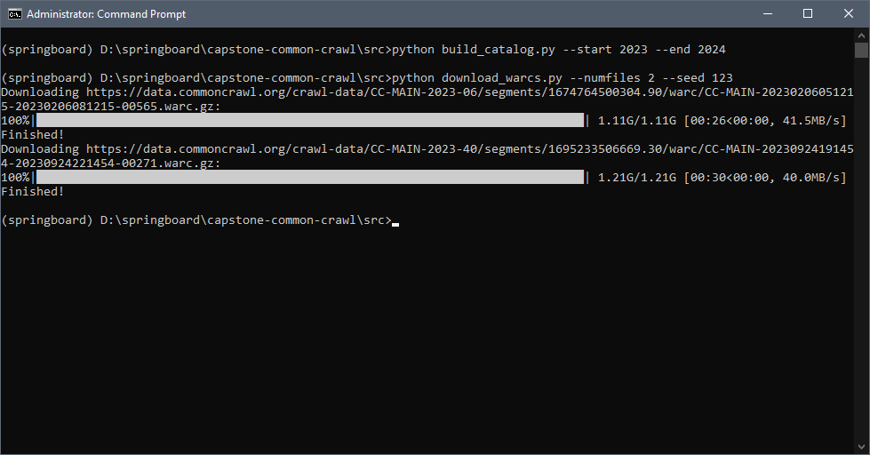

# Common Crawl Capstone Project
This repository houses all code for a capstone project for the WashU/Springboard Data Engineering Bootcamp (March 2024 cohort). This project seeks to construct a scalable pipeline for ingesting and presenting large web archives (WARC) of scraped web data from the Common Crawl dataset (https://commoncrawl.org/).

This Readme can be referenced to to reproduce this work in which a *sample* of the Common Crawl data (which is petabytes in size) is extracted, transformed, and loaded into a data warehouse environment.

## Data Acquisition
WARC files can be downloaded locally by means of two scripts contained within the project's <tt>src</tt> directory. To begin, the user should determine the span of years they would like to ingest data from, as well as the number of files they would like to ingest. At the moment, requests to the Common Crawl dataset is limited at 10 files per run.

To download data, the user must first construct a data catalog that contains all the URLs of the zipped WARC files (the full dataset contains hundreds of thousands of URLs). From here, a random sampling of data can then be ingested via the following steps:

1) Run <tt>build_catalog.py</tt> from the terminal. This can be done in the following manner:
```sh
python build_catalog.py --start A --end B
```

Where A is the year to start getting data from, and B is the year to end getting data from. This allows for the offline storage of the relatively large data catalog that will be generated when looking at multiple years.

2) Run <tt>download_warcs.py</tt> in the following way:
```sh
python download_warcs.py --numfiles A --seed B
```

Where A is the number of files to download (capped at 10 per run) and B is a random seed for reproducibily of random file sampling.

When complete the data catalog and zipped WARC files will be saved to the <tt>data</tt> folder, whose contents should be masked via the <tt>.gitignore</tt>.

Example:

