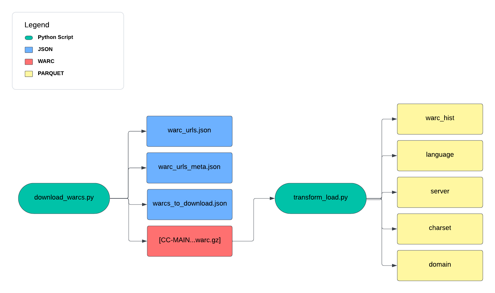
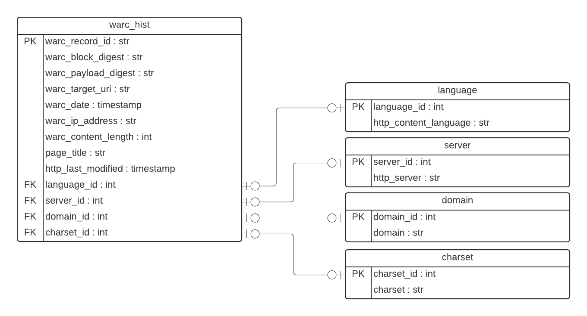

# Common Crawl Capstone Project
This repository houses all code for a capstone project for the WashU/Springboard Data Engineering Bootcamp (March 2024 cohort). This project seeks to construct a scalable pipeline for ingesting and presenting large web archives (WARC) of scraped web data from the Common Crawl dataset (https://commoncrawl.org/).

This Readme can be referenced to to reproduce this work in which a *sample* of the Common Crawl data (which is petabytes in size) is extracted, transformed, and loaded into a data warehouse environment.

## Data Acquisition, Transform, and Loading Process
The current pipeline prototype leverage two Python scripts executed via <tt>spark-submit</tt>. These are planned to be included as part of an orchestration pipeline that executes these tasks sequentially. The general workflow follows this format:

1) <tt>download_warcs.py</tt> will scrape the Common Crawl website to establish crawls that are available for the current year (this can be adjusted by the user to pull previous years). This populates <tt>.json</tt> files with a listing of all URLs available for download for that crawl. Any newly found crawls are queued for ingestion in <tt>warcs_to_download.json</tt>.

This script will then download all new URLs in the queue. The project currently caps the number of downloads to 1 URL per crawl, with an absolute maximum of 10 downloads per run. After downloads are complete, the queue file is emptied.

2) <tt>transform_load.py</tt> will then extract necessary contents from all downloaded WARCs, and convert these into Spark DataFrames. Integer IDs will also be generated for additional tables that are created for normalization (the WARC records themselves already have a unique identifier). The outputs are currently in <tt>.parquet</tt> format, using the following schema:

## To Do
This pipeline is currently a prototype in review. Next steps will involve implementing this in a cloud environment to allow for ingestion of a larger number of files.